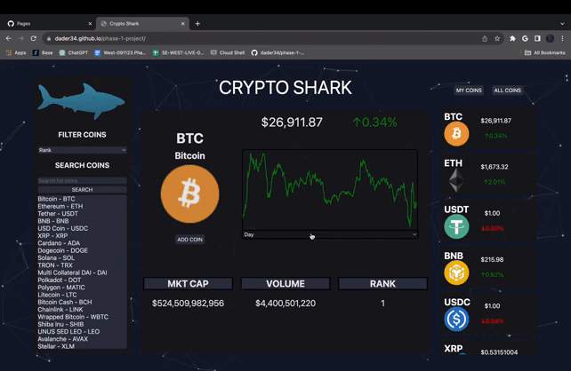
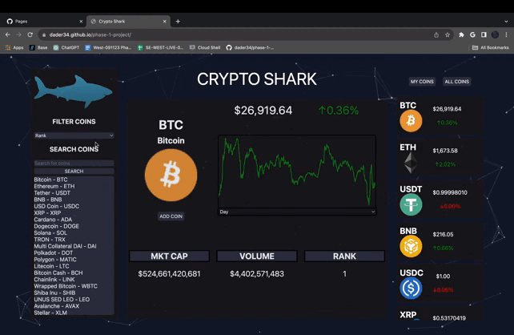
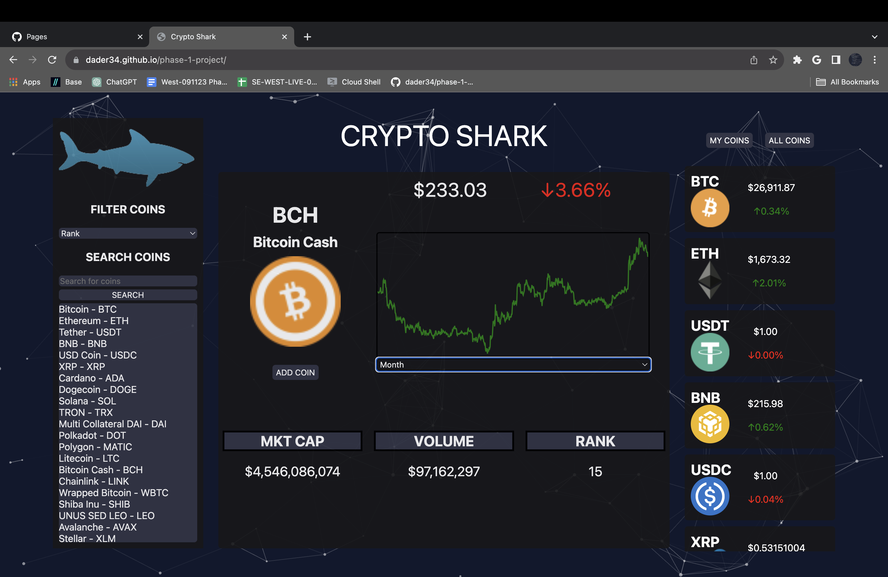
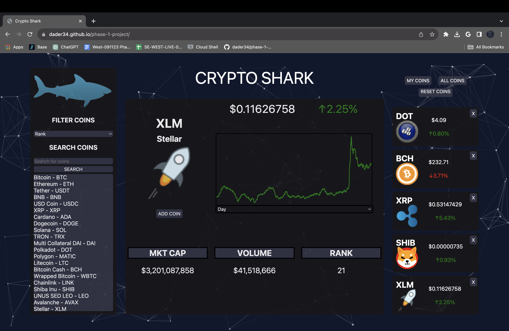
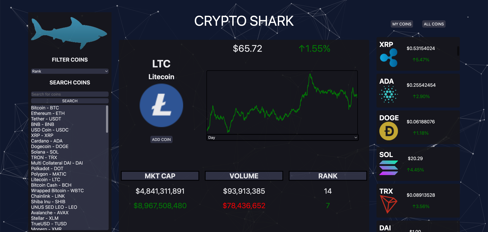
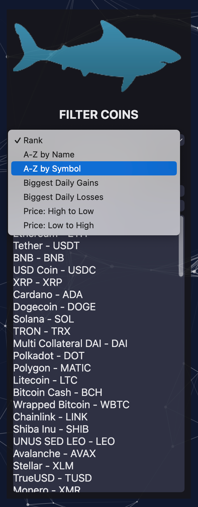
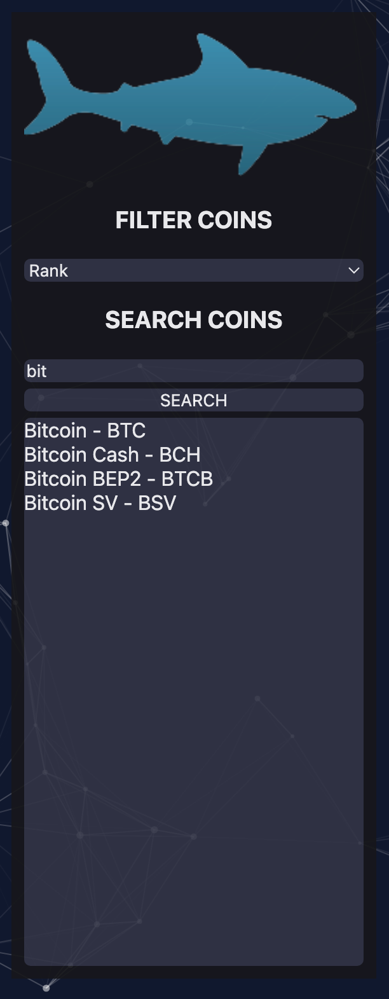
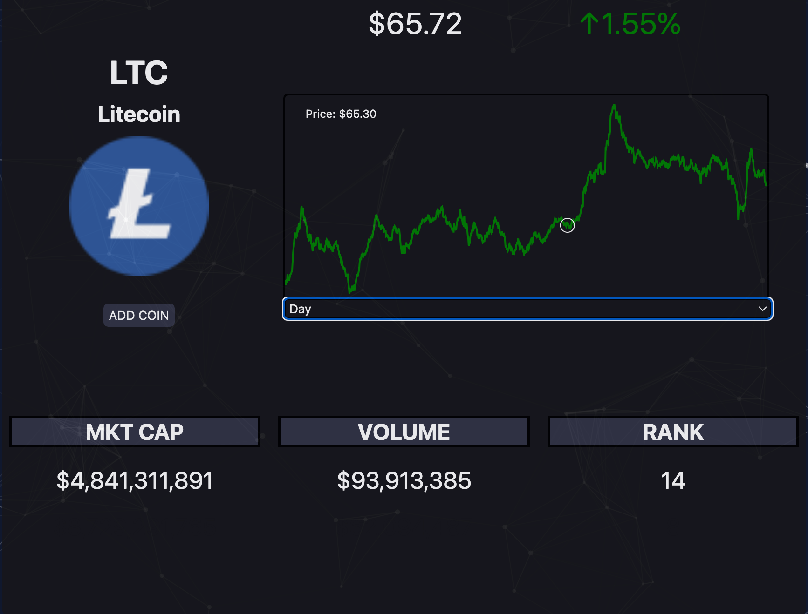

# **Get Your Day Started Right — Don't Wake Up Virtually Broke!**

## Welcome to Crypto Shark, your go-to cryptocurrency viewing platform designed to ensure you're financially prepared for the day ahead.

> **What Can You Do with Crypto Shark?**

* *Effortless Tracking*: Keep an eye on your investments without lifting a finger.
* *Real-Time Market Insights*: Display an extensive range of cryptocurrencies, complete with real-time market prices.
<!-- * *Social Media Pulse*: Get actionable insights by pulling data from major social media platforms to inform your next purchase. -->

All this is possible through our dynamic website, powered by cutting-edge API's.

# Installation Instructions

> **Ready to dodge financial pitfalls? Here's how to get started.**

* Fork and Clone: Fork this repository and copy the SSH key from your forked repo.

* Navigate: Open the directory where you wish to clone the repo.

* (optional) To create a new directory, type mkdir "your-new-directory-name".

* Clone: Inside your directory, type git clone followed by pasting the SSH key you copied.

* Launch: Navigate into the git folder with cd, then type *Code .* to launch the VsCode editor.

>* Mac Users:
* Open the terminal and navigate to the folder containing the cloned git repo.
* Launch the HTML file using *open index.html*.
* If you run into any CORS policy issues, run the site using the *Live Server* extension on VsCode.

>* Windows Users
* Open powershell or wsl and navigate to the folder containing the cloned git repo.
* Type explorer.exe index.html to open Crypto Shark.
* If you run into any CORS policy issues, follow the steps mentioned above in the mac section.

# Usage Instructions
## Search
* You can search for individual or multiple cryptos on the left side of the screen using the search bar or the filter dropdown.
* Press search or enter to search for a specific name, id, or symbol.
* Any coin that you click on the left will be populated to the center display, including a graph and stats.
## Center Display
* You can change the graph's interval to Day, Month, or Year.
* Hover over the graph with your mouse to see price points at a certain time.
* Press the *Add coin* button on the main display to add a coin to your personal watch list, press the X on the card to remove them.
## Personal Coins
* You can have a max of 5 personal coins, and they persist through page reload using cookies.
* Be careful not to edit your cookies or it may lead to unintended consequences
* Hovering over a coin card will compare the coin in the main display to the one you are mousing over.

>* Special instructions
* Use CMD + M to toggle animations, and CMD + K to toggle mouse interactivity with the background.
* Windows users use ctrl instead of command.

## Visual Operations

1. 
2. 
3. 
4. 
5. 
6. Compare coins from "All Coins" with currently displayed coin:

7. Display all coins from the API through different filter options:

8. Search for a specific coin:

9. Display in real-time the price for a certain date on a coin's price history graph:

## Authors

1. [Dominic DeCelle](https://www.linkedin.com/in/dominic-decelle-376b02292/)
2. [Connor Adams](https://www.linkedin.com/in/connor-adams-386030b3/) 
3. [Danner Baumgartner](https://www.linkedin.com/in/danner-baumgartner-a2a461254/)

## Outstanding API's
* [CoinCap API](https://docs.coincap.io) - For all of our coin data and history
* [CoinAPI](https://docs.coinapi.io/) - For all of our coin image assets

## **Licenses**

* [MIT](https://github.com/dader34/phase-1-project/blob/main/LICENSE)

## **Other Sources**
* [StickyLife](https://www.stickylife.com/) - Shark image
* [tsParticles](https://particles.js.org/) - Particles and effects

## If you would like to follow our growth, feel free to check out our other projects!
* [Dominic DeCelle's Projects:](https://github.com/irevisionize)
* [Danner Baumgartner's Projects:](https://github.com/dader34)
* [Conner Adams Projects:](https://github.com/ConnorVAdams)

